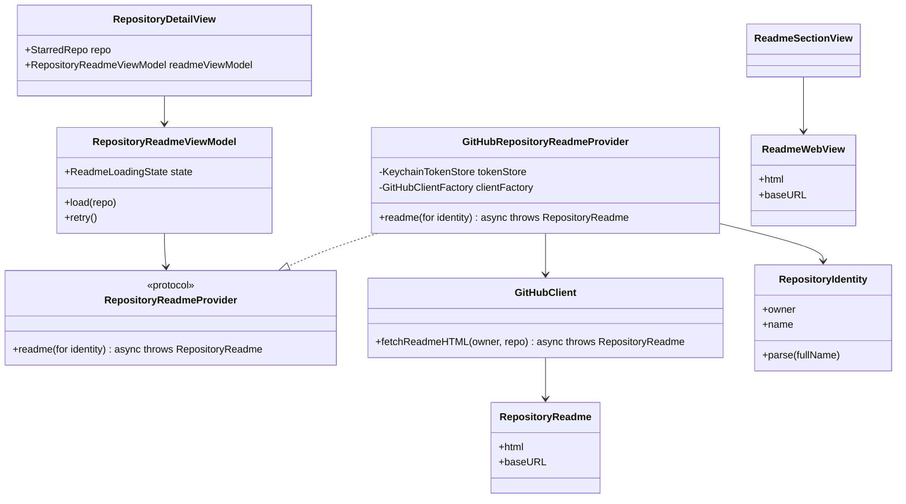
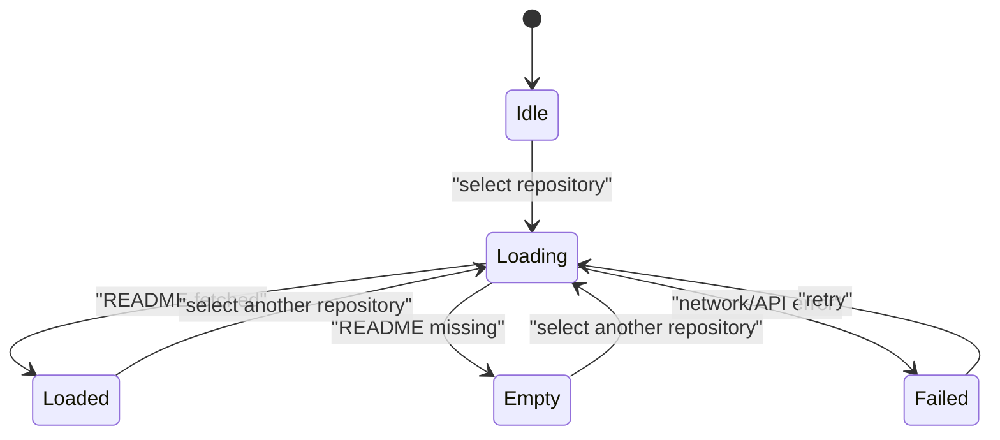
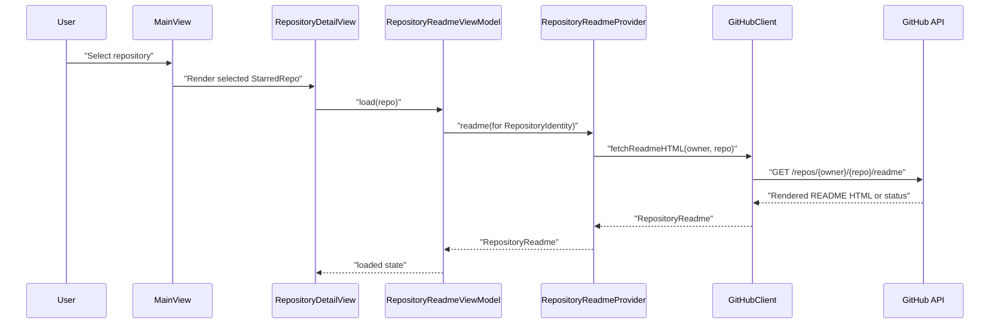

# Show Repository README in Detail View

## Background and Goal

StarMagpie already lets users click a starred repository and inspect local metadata, categories, notes, and actions. The next useful step is to show the selected repository's README in the same detail area, so users can quickly evaluate or revisit a project without opening GitHub.

User-visible result:

- When a repository is selected, the detail pane loads and displays that repository's README.
- The README area shows loading, loaded, empty/not found, and error states.
- The existing metadata, notes, open link, copy link, and unstar workflows remain available.
- Tokens continue to live only in Keychain and are never persisted to SwiftData or logs.

## Current State

Relevant existing modules:

- `StarMagpie/Views/MainView.swift` owns the selected repository and creates `RepositoryDetailView`.
- `StarMagpie/Views/RepositoryDetailView.swift` shows local metadata, category picker, notes editor, and actions.
- `StarMagpie/Services/GitHubClient.swift` owns authenticated GitHub REST calls through the `HTTPSession` abstraction.
- `StarMagpie/Services/StarRepository.swift` owns high-level authenticated repository workflows using a Keychain-backed token.
- `StarMagpie/Models/StarredRepo.swift` stores synced repository metadata and local fields.
- `StarMagpieTests/GitHubClientTests.swift` already validates request construction, pagination, status handling, and mock session behavior.

Reusable capabilities:

- `GitHubClient.makeRequest` already centralizes authorization, `Accept`, and `X-GitHub-Api-Version`.
- `HTTPSession` makes network calls testable without real GitHub access.
- `AppLocalizer` supports manual in-app language switching for dynamic UI text.

Current limits:

- `RepositoryDetailView` has no async loading model and no injected service.
- `StarredRepo` stores only repository list metadata; it does not store README content.
- There is no Markdown or HTML rendering view.
- README requests require parsing `owner/repo` from `StarredRepo.fullName`.

## First-Principles Analysis

Core business objects:

- Repository identity: stable GitHub repository id plus `owner/repo` full name.
- README document: remote, optional, repository-scoped content.
- README loading state: UI state derived from an async fetch lifecycle.
- README renderer: presentation object that turns fetched README content into a native macOS view.

Invariants:

- The GitHub token remains an infrastructure dependency and is never copied into model fields.
- README content is selected-repository scoped; content from an old selection must not appear under a new selection.
- A missing README is not a sync failure and must be shown as an empty/not found state.
- GitHub rate limit and authorization failures should reuse the same localized error behavior as existing GitHub requests.
- Notes remain local and editable even if README loading fails.

Change points:

- README source format: rendered HTML first; raw Markdown can be added later.
- Rendering strategy: WebKit-backed HTML renderer first; a native Markdown renderer can be substituted later.
- Caching policy: in-memory per detail session first; persistent cache can be added later.
- Retry behavior: manual retry button first; automatic refresh policy can be added later.

## Class Model Design

New and reused types:

- Reuse `HTTPSession`: keeps network tests isolated from real GitHub.
- Extend `GitHubClient` with `fetchReadmeHTML(owner:repo:) async throws -> RepositoryReadme`.
- Add `RepositoryReadme`: value object containing `html`, `baseURL`, and source metadata needed by the renderer.
- Add `RepositoryIdentity`: small parser/value object that validates `owner/repo` before network access.
- Add `ReadmeLoadingState`: enum representing `idle`, `loading`, `loaded`, `empty`, and `failed`.
- Add `RepositoryReadmeProvider` protocol: high-level abstraction used by the view model.
- Add `GitHubRepositoryReadmeProvider`: concrete provider that loads token from Keychain and delegates to `GitHubClient`.
- Add `RepositoryReadmeViewModel`: `@MainActor` orchestration object that owns state, cancels stale loads, and exposes `load(repo:)` / `retry()`.
- Add `ReadmeWebView`: `NSViewRepresentable` wrapper around `WKWebView` for rendered README HTML.
- Add `ReadmeSectionView`: SwiftUI section that maps `ReadmeLoadingState` to UI.

Dependency direction:

- `RepositoryDetailView` depends on `RepositoryReadmeViewModel`.
- `RepositoryReadmeViewModel` depends on `RepositoryReadmeProvider`.
- `GitHubRepositoryReadmeProvider` depends on `KeychainTokenStore` and `GitHubClient` factory.
- `GitHubClient` remains the only GitHub HTTP implementation.

Composition root:

- `ContentView` or `MainView` will create the concrete `GitHubRepositoryReadmeProvider`.
- Tests will inject a mock `RepositoryReadmeProvider` into `RepositoryReadmeViewModel`.

## State and Data Flow

State model:

- `idle`: detail view has not started loading.
- `loading(repoId)`: selected repository README is being fetched.
- `loaded(repoId, readme)`: README HTML belongs to the selected repository.
- `empty(repoId)`: GitHub returned 404 for README.
- `failed(repoId, message)`: request failed and can be retried.

Allowed transitions:

- `idle -> loading`
- `loading -> loaded`
- `loading -> empty`
- `loading -> failed`
- any state for old repo -> `loading` for new repo
- `failed -> loading` through retry

Request/data flow:

## GitHub API Boundary

The implementation will add one GitHub REST call:

- Method: `GET`
- Path: `/repos/{owner}/{repo}/readme`
- Accept: GitHub rendered README HTML media type
- Auth: existing `Bearer` token
- Version header: existing `X-GitHub-Api-Version: 2022-11-28`

Status handling:

- `200..<300`: decode response data as UTF-8 HTML.
- `404`: convert to a missing README state, not a global app error.
- `401`, `403` rate limit, invalid response, and other HTTP statuses follow the existing `GitHubClientError` rules.

## UI Design

The detail pane should keep the current hierarchy:

1. Header, stats, metadata, category.
2. README section.
3. Notes section.
4. Actions.

README section behavior:

- Title: `README`.
- Loading: compact `ProgressView`.
- Empty: `ContentUnavailableView` style message.
- Error: localized message plus retry button.
- Loaded: scrollable rendered README content.

The screenshot shows useful vertical space below notes; the implementation should avoid making notes dominate the detail pane. A practical layout is:

- Keep metadata compact.
- Place README before notes so clicking a repository immediately surfaces the project content.
- Reduce notes editor default height if needed so README appears in the first detail-page scroll.

Rendering:

- Use `WKWebView` inside `NSViewRepresentable`.
- Inject a small local stylesheet so README respects light/dark mode and current macOS text colors.
- Open clicked links externally with `NSWorkspace` instead of navigating inside the embedded README.

## Localization

Add all new user-facing strings to both:

- `StarMagpie/en.lproj/Localizable.strings`
- `StarMagpie/zh-Hans.lproj/Localizable.strings`

Expected strings:

- `README`
- `Loading README...`
- `No README found`
- `This repository does not have a README.`
- `Could not load README`
- `Retry`
- `Repository README is unavailable because the repository name is invalid.`

## Logging Design

The current app has no structured logging layer. This feature will not add ad-hoc logs.

Error visibility stays in UI state:

- Authentication, rate limit, invalid response, and HTTP failures are converted to localized UI messages.
- Tokens and README content are never logged.

If structured logging is added later, log only non-sensitive metadata such as `repo_id`, `full_name`, `event`, `status_code`, and a generated `trace_id`; never log tokens, authorization headers, or README bodies.

## Implementation Steps

1. Add README DTO/value and identity parsing types.
2. Extend `GitHubClient` with `fetchReadmeHTML(owner:repo:)`.
3. Add `RepositoryReadmeProvider` and concrete Keychain-backed provider.
4. Add `ReadmeLoadingState` and `RepositoryReadmeViewModel` with stale-load protection.
5. Add `ReadmeWebView` and `ReadmeSectionView`.
6. Wire the provider/view model into `RepositoryDetailView` through `MainView` or the nearest composition root.
7. Update English and Simplified Chinese localization files.
8. Add unit tests for client request construction, 404 mapping, identity parsing, and view-model state transitions.
9. Run `xcodegen generate` if `project.yml` changes; otherwise skip.
10. Run `xcodebuild test -scheme StarMagpie -destination 'platform=macOS'`.

## Tests and Acceptance

Automated tests:

- `GitHubClientTests`: README request uses `/repos/{owner}/{repo}/readme`, bearer token, API version header, and README HTML accept header.
- `GitHubClientTests`: 404 maps to a README-not-found error/state path.
- `RepositoryIdentityTests`: valid `owner/repo` parses; invalid strings fail explicitly.
- `RepositoryReadmeViewModelTests`: load success, missing README, failure, retry, and stale response protection.

Manual validation:

- Select a repository with README: README renders in the detail pane.
- Select a repository without README: localized empty state appears.
- Select repositories quickly: old README content does not flash under the new repository.
- Use Simplified Chinese language mode: new README strings localize immediately.
- Switch macOS light/dark mode: README remains readable.
- Unstar and notes editing continue working.

## Risks and Rollback

Risks:

- WebKit adds a new framework dependency and needs careful link-opening behavior.
- Rendered GitHub HTML may include relative links or images; the `baseURL` must point to the GitHub repository page.
- Large README files can be expensive to render; first implementation should avoid persistent storage and only hold selected README state.
- GitHub API rate limits apply to README fetches as well as sync.

Rollback:

- Remove README section and provider wiring.
- Remove the `fetchReadmeHTML` method and related tests.
- Keep existing repository sync, notes, import/export, and unstar behavior unchanged.
